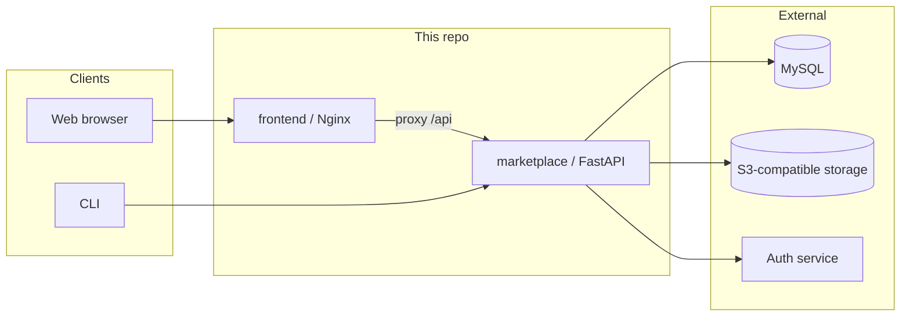

# openJiuwen Agentic Hub

[](LICENSE)
[](marketplace/pyproject.toml)
[](frontend/package.json)

**Chinese**: [README_zh.md](README_zh.md)

**openJiuwen Agentic Hub** is an open-source **Skill hosting and distribution** implementation in the openJiuwen ecosystem, intended for self-hosted team deployments.

**ClawHub compatibility** can be enabled so existing ClawHub-oriented CLIs and tools can integrate (exact routes and semantics follow this codebase).

## Contents

- [Features](#features)
- [Architecture](#architecture)
- [Stack & prerequisites](#stack--prerequisites)
- [Quick start](#quick-start)
- [Documentation](#documentation)
- [Security](#security)
- [Contributing](#contributing)
- [License](#license)

## Features

- **Marketplace service**: publish and version Skills, list/detail, presigned downloads; optional **ClawHub-compatible** API surface.
- **CLI**: search, resolve, and download — [`cli/README.md`](cli/README.md).
- **Web UI**: browser-based flows — see the [install docs](docs/zh/3.%20安装指导/README.md).

**Hosted offering**: **[swarmskills.openjiuwen.com](https://swarmskills.openjiuwen.com)**. Use this repository when you need on-premises data, isolation, or internal integration.

## Architecture



## Stack & prerequisites

| Piece | Notes |
|------|--------|
| **marketplace** | Python **≥ 3.11.4**, FastAPI / SQLAlchemy — [`marketplace/pyproject.toml`](marketplace/pyproject.toml) |
| **frontend** | React 18, Vite, MUI — **Node.js 18+ or 20 LTS** recommended |
| **Data** | **MySQL** (required); **MinIO** or **Huawei OBS** (S3-compatible, required) |
| **Auth** | Configurable auth endpoint (`AUTH_*` in `.env` — see **[`.env.example`](.env.example)**) |

Never commit secrets; copy `.env.example` to `.env` locally.

## Quick start

### Hosted

Use **[swarmskills.openjiuwen.com](https://swarmskills.openjiuwen.com)**.

### Docker Compose (one command)

Start everything — MySQL, Redis, MinIO, Backend, Frontend — with a single command. No need to install MySQL, Redis, or MinIO locally. Full guide: [Docker one-click deploy](docs/zh/3.%20安装指导/Docker方式安装/openJiuwen-Agentic-Hub安装指导-一键部署.md).

```bash
# repo root
cp .env.example .env
# edit .env (defaults work out of the box)
docker compose -f docker/docker-compose.yml --env-file .env up -d --build
```

- Frontend: `http://localhost:9002`
- Backend health: `http://localhost:8100/api/health`

### Local development (minimal)

You need **MySQL** (DB created upfront), **S3-compatible storage** (e.g. MinIO), and a reachable **auth service**. Full steps (Windows-focused, also useful on Linux/macOS for commands): [Local installation guide](docs/zh/3.%20安装指导/本地安装/openJiuwen-Agentic-Hub安装指导.md).

```bash
# repo root
cp .env.example .env
# edit .env

cd marketplace
uv sync
source .venv/bin/activate   # Windows: .venv\Scripts\activate
python main.py
```

- Listen address: **`STORE_HOST` / `STORE_PORT`** (defaults to **127.0.0.1:8100**; set `STORE_HOST=0.0.0.0` to allow LAN access).
- Health: `http://127.0.0.1:<STORE_PORT>/api/health`

Optional UI (open a new terminal and run from the repository root):

```bash
cd frontend
npm install
npm run dev
```

Dev server defaults to port **9002**. Set **`BACKEND_PORT`** to the backend port exposed by **`STORE_PORT`**. **`BACKEND_URL`** must be an address the frontend process can reach (for local development, normally `127.0.0.1`); it is not the backend bind address **`STORE_HOST`**. See the [install doc §6](docs/zh/3.%20安装指导/本地安装/openJiuwen-Agentic-Hub安装指导.md).

### Docker

See [Docker install (Windows, Chinese)](docs/zh/3.%20安装指导/Docker方式安装/openJiuwen-Agentic-Hub安装指导.md) for backend and frontend image build/run.

### API & CLI

- **HTTP API**: [openJiuwen Agentic Hub API reference (Chinese)](docs/zh/7.%20API参考/openJiuwen-Agentic-Hub-接口参考.md) · [OpenAPI YAML](docs/zh/7.%20API参考/openJiuwen-Agentic-Hub.md)
- **CLI**: [`cli/README.md`](cli/README.md)

### Ecosystem

[GitHub · openJiuwen-ai](https://github.com/openJiuwen-ai/)

## Documentation

### User guides (Chinese)

| Topic | Link |
|--------|------|
| Docs index | [docs/zh/README.md](docs/zh/README.md) |
| Getting started | [Quick start](docs/zh/2.%20快速开始.md) |
| Roles & permissions | [Roles and permissions](docs/zh/4.%20用户指南/角色与权限.md) |
| Tutorials & FAQ | [Tutorials and FAQ](docs/zh/4.%20用户指南/场景化指引与FAQ.md) |
| Environment (users) | [Environment configuration](docs/zh/4.%20用户指南/环境配置说明.md) |
| Changelog | [CHANGELOG.md](CHANGELOG.md) |

### Install & development

| Topic | Link |
|--------|------|
| Local install (Windows-focused) | [Installation guide](docs/zh/3.%20安装指导/本地安装/openJiuwen-Agentic-Hub安装指导.md) |
| Docker install | [Docker installation guide](docs/zh/3.%20安装指导/Docker方式安装/openJiuwen-Agentic-Hub安装指导.md) |
| API (OpenAPI) | [openJiuwen-Agentic-Hub.md](docs/zh/7.%20API参考/openJiuwen-Agentic-Hub.md) |
| API reference (detailed) | [Detailed API reference](docs/zh/7.%20API参考/openJiuwen-Agentic-Hub-接口参考.md) |
| CLI | [cli/README.md](cli/README.md) |
| Contributing | [CONTRIBUTING.md](CONTRIBUTING.md) |

## Security

If you expose openJiuwen Agentic Hub on the public internet or untrusted networks, review authentication, storage credentials, system tokens, and compatibility endpoints; use gateways, network policy, and least privilege.

**Vulnerability reports**: [SECURITY.md](SECURITY.md).

## Contributing

Issues and pull requests are welcome. See [CONTRIBUTING.md](CONTRIBUTING.md).

## License

**Apache License 2.0** — see [LICENSE](LICENSE).

This product serves solely as a workflow orchestration tool and does not embed any AI model capabilities. When users integrate AI models for specific business scenarios, they shall bear full responsibility for compliance obligations under the EU AI Act and other relevant regulatory frameworks.
