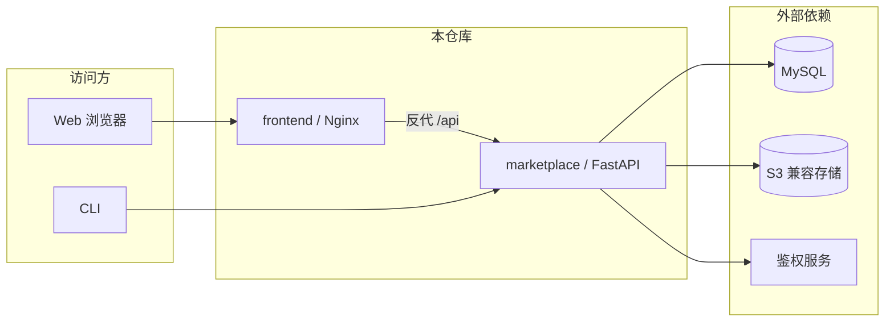

# openJiuwen Agentic Hub

[](LICENSE)
[](marketplace/pyproject.toml)
[](frontend/package.json)

**English**: [README.md](README.md)

**openJiuwen Agentic Hub**（本仓库）是 openJiuwen 生态中的 **Skill 托管与分发** 开源实现，供团队在自有环境中部署使用。  
**ClawHub 兼容协议**：可选启用，便于与既有 **ClawHub** 生态下的 CLI 与工具链对接（路径与语义以实现为准）。

## 目录

- [核心能力](#核心能力)
- [架构一览](#架构一览)
- [技术栈与依赖](#技术栈与依赖)
- [快速开始](#快速开始)
- [文档索引](#文档索引)
- [安全](#安全)
- [贡献](#贡献)
- [许可证](#许可证)

## 核心能力

- **市场服务（marketplace）**：Skill 发布与版本治理、列表与详情、预签名下载；可按需启用 **ClawHub 兼容协议**，便于对接既有 CLI 与生态工具。
- **命令行工具（CLI）**：检索、解析与下载（详见 [`cli/README.md`](cli/README.md)）。
- **Web 前端（frontend）**：浏览器中检索、解析与下载（详见 [安装指导](docs/zh/3.%20安装指导/README.md)）。

面向需要在团队或产品内集中管理 **Skill** 的开发者与平台运维，本仓库提供 **开源代码与自建方案**。

**官方托管**：openJiuwen 产品侧已提供 **[swarmskills.openjiuwen.com](https://swarmskills.openjiuwen.com)**，可在浏览器中直接使用。  
若需数据驻留、网络隔离或与内部系统对接，可在本机或自有环境按下文部署本仓库。

## 架构一览



## 技术栈与依赖

| 组件 | 说明 |
|------|------|
| **marketplace** | Python **≥ 3.11.4**，FastAPI / SQLAlchemy；依赖见 [`marketplace/pyproject.toml`](marketplace/pyproject.toml) |
| **frontend** | React 18、Vite、MUI；本地开发建议 **Node.js 18+ 或 20 LTS** |
| **数据与存储** | **MySQL**（必选）；**MinIO** 或 **华为云 OBS** 等 S3 兼容存储（必选） |
| **鉴权** | 服务依赖可配置的 **鉴权服务端点**（`.env` 中 `AUTH_*` 等，以 `.env.example` 为准） |

完整环境变量说明以仓库根目录 **[`.env.example`](.env.example)** 为模板：**请勿将含密钥的 `.env` 提交到版本库**。

## 快速开始

### 1. 官方托管（零部署）

访问 **[swarmskills.openjiuwen.com](https://swarmskills.openjiuwen.com)** 进行 Skill 检索、解析与下载。

### 2. 自建：最短路径（本地开发）

前置条件：已准备好 **MySQL**（须预先建库）、**S3 兼容存储**（如 MinIO）、**鉴权服务**可达。详见 [本地安装指导](docs/zh/3.%20安装指导/本地安装/openJiuwen-Agentic-Hub安装指导.md)。

```powershell
# 在仓库根目录
Copy-Item .env.example .env
# 编辑 .env，填写数据库、对象存储、鉴权等配置

cd marketplace
uv sync
.\.venv\Scripts\activate   # Linux/macOS: source .venv/bin/activate
python main.py
```

- 服务监听地址由 **`STORE_HOST` / `STORE_PORT`** 决定（默认 **127.0.0.1:8100** 仅本机访问；如需局域网访问，将 `STORE_HOST` 设为 `0.0.0.0`）。
- **健康检查**：`http://127.0.0.1:<STORE_PORT>/api/health`

可选启动 Web 界面（请新开一个 PowerShell 窗口，从仓库根目录执行）：

```powershell
cd frontend
npm install
npm run dev
```

- 开发服默认 **9002**（以终端输出为准）；`BACKEND_PORT` 应对应后端的 `STORE_PORT`；`BACKEND_URL` 须填写前端进程可访问的后端地址（本机开发通常为 `127.0.0.1`），不要照抄后端监听地址 `STORE_HOST`（尤其是 `0.0.0.0` 这类通配地址）。详细说明见 [本地安装指导 §6](docs/zh/3.%20安装指导/本地安装/openJiuwen-Agentic-Hub安装指导.md)。

### 3. 自建：Docker

参阅 [Docker 方式安装（Windows）](docs/zh/3.%20安装指导/Docker方式安装/openJiuwen-Agentic-Hub安装指导.md)（含后端与前端镜像构建）。

### 4. API 与 CLI

- **HTTP API**：[openJiuwen Agentic Hub 接口参考](docs/zh/7.%20API参考/openJiuwen-Agentic-Hub-接口参考.md)（推荐）· [OpenAPI YAML](docs/zh/7.%20API参考/openJiuwen-Agentic-Hub.md)
- **CLI**：[`cli/README.md`](cli/README.md)

### 5. 生态与全栈实践

参阅 [GitCode · openJiuwen](https://gitcode.com/openJiuwen) 官方文档与实践。

## 文档索引

### 用户指南

| 主题 | 链接 |
|------|------|
| 文档总览 | [docs/zh/README.md](docs/zh/README.md) |
| 新用户入门 | [快速开始](docs/zh/2.%20快速开始.md) |
| 角色与权限 | [角色与权限](docs/zh/4.%20用户指南/角色与权限.md) |
| 场景化指引与 FAQ | [场景化指引与 FAQ](docs/zh/4.%20用户指南/场景化指引与FAQ.md) |
| 环境配置说明 | [环境配置说明（使用者）](docs/zh/4.%20用户指南/环境配置说明.md) |
| 版本变更记录 | [CHANGELOG.md](CHANGELOG.md) |

### 安装与开发

| 主题 | 链接 |
|------|------|
| 本地安装（Windows 为主） | [安装指导](docs/zh/3.%20安装指导/本地安装/openJiuwen-Agentic-Hub安装指导.md) |
| Docker 安装（Windows） | [Docker 方式安装](docs/zh/3.%20安装指导/Docker方式安装/openJiuwen-Agentic-Hub安装指导.md) |
| 市场 API（OpenAPI） | [openJiuwen-Agentic-Hub.md](docs/zh/7.%20API参考/openJiuwen-Agentic-Hub.md) |
| 市场 API 接口参考（推荐） | [openJiuwen-Agentic-Hub-接口参考.md](docs/zh/7.%20API参考/openJiuwen-Agentic-Hub-接口参考.md) |
| CLI | [cli/README.md](cli/README.md) |
| 贡献说明 | [CONTRIBUTING.md](CONTRIBUTING.md) |

## 安全

若将 openJiuwen Agentic Hub / marketplace **部署在公网或不受信任的网络**中，请务必在上线前评估鉴权、对象存储密钥、系统令牌与兼容层暴露面等风险，并通过网关、网络策略与最小权限采取防护措施。

**报告漏洞**：见 [SECURITY.md](SECURITY.md)。

## 贡献

欢迎通过 Issue 与 Pull Request 反馈问题、改进文档或提交代码。流程与约定见 [CONTRIBUTING.md](CONTRIBUTING.md)。

## 许可证

本项目采用 **Apache License 2.0**。详见根目录 **[LICENSE](LICENSE)** 文件。

---

openJiuwen Agentic Hub — 让 Skill 在 openJiuwen 生态中更易分发与复用。

本产品仅作为流程编排工具，不包含 AI 模型能力；用户在连接 AI 模型用于特定业务场景时，需自行承担欧盟 AI 法案等相关合规义务。

