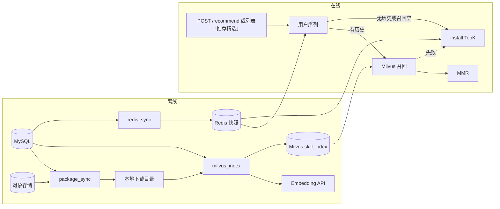
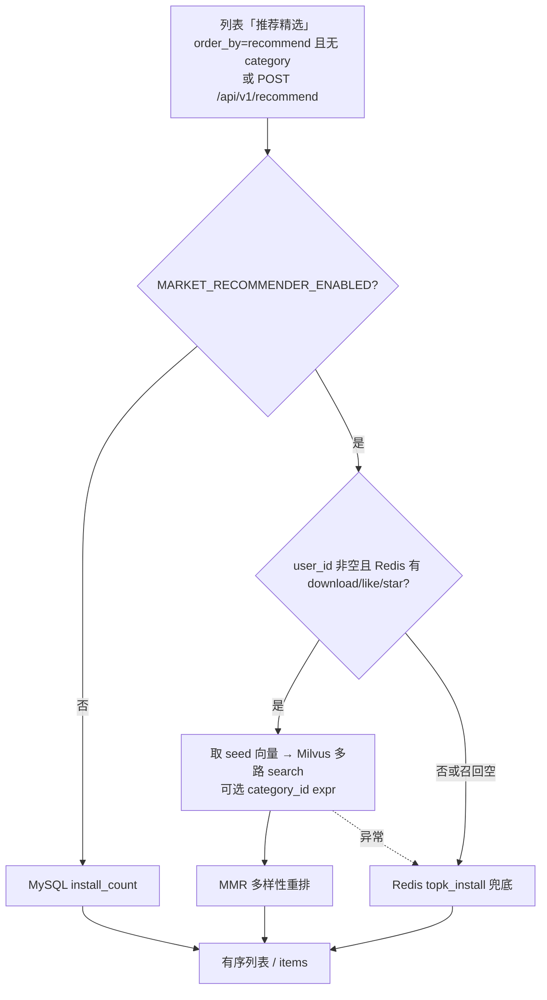

# 推荐系统

`marketplace/recommender/` 提供 openJiuwen Agentic Hub 个性化推荐：离线建库 + 在线召回。与 `marketplace/retrieval/`（语义搜索）相互独立，Embedding、向量库、Redis key 均单独配置。

**测试请先读**[运维指南 / 推荐系统](../../6.%20运维指南/可选能力/推荐系统/README.md)里的「启动时会不会自动跑一次？」和「怎么验收」。HTTP 字段见[推荐系统 API](../../7.%20API参考/推荐系统API.md)。下文是实现边界，给改代码和排障用。

启动时 **不会** 把四条 cron 都跑一遍：默认只是挂上定时器。只有 `.env` 里 `MARKET_REC_REBUILD_ON_STARTUP=true` 时，启动才会立刻跑 `redis_sync` + `milvus_full`（仍不跑 `package_sync`）。代码默认该开关为 true，`.env.example` 为 false，**以实际 `.env` 为准**。

## 定位与边界

- **做什么**：无搜索关键词时，按用户历史做相似召回并做多样性重排；没有历史则用下载量排序兜底。
- **不做什么**：不替代检索。`search_keyword` 非空时列表仍走检索 / 关键词逻辑。
- **开关**：`MARKET_RECOMMENDER_ENABLED=true` 才注册 `POST /api/v1/recommend*`、调度离线任务、列表「推荐精选」（`order_by=recommend` 且无 `category_id`）。关闭时该列表参数回退 `install_count`。「全部」和分类页签始终按下载量查表。
- **依赖**：MySQL（资产与行为）、对象存储（Skill zip）、Redis（用户序列与 TopK 快照）、Milvus（向量）、独立 Embedding API（`MARKET_REC_EMBEDDING_*`，不要复用检索侧变量）。

## 模块结构

| 路径 | 职责 |
|------|------|
| `recommender/offline/package_sync/` | MySQL 最新上架 Skill → 对象存储拉 zip 到本地下载目录 |
| `recommender/offline/milvus_index/` | 解析 `SKILL.md` → Embedding → upsert Milvus；本地 `milvus_index_state.json` 做增量差量 |
| `recommender/offline/redis_sync/` | MySQL 聚合：用户 download/like/star 序列 + install TopK 快照写入 Redis |
| `recommender/online/` | 在线级联：历史种子 → Milvus → MMR → TopK 兜底 |
| `recommender/shared/config.py` | 从 **进程环境变量** 读配置（`os.getenv`） |
| `plugins_market/recommender/` | 与 marketplace Settings / 列表 / APScheduler 的桥接 |
| `plugins_market/routers/recommender.py` | HTTP API |
| `plugins_market/services/plugin.py` | 列表 `order_by=recommend` 与 `POST /recommend` 共用的过滤 + 卡片 hydrate |

两层配置：

- marketplace 进程：`plugins_market.core.config.Settings` 读根目录 `.env`，再由 `apply_recommender_settings_to_env()` 把 Redis / Milvus 等补进 `os.environ`。
- 离线 CLI：`recommender.shared.config.load_config()` **只读当前进程环境**，自己不 `load_dotenv`。

## 总体架构



## 数据与存储

### MySQL

离线任务直接用 `DB_HOST` / `DB_USER` / `STORE_DB_NAME` 等连库（与 marketplace 同一套）。

| 用途 | 来源（概念） |
|------|----------------|
| 可推荐资产 | 非 `OFFLINE` 的最新版本 Skill / SwarmSkill |
| 用户下载序列 | `plugin_fetch_records`（跳过空 `fetch_user_id`） |
| 点赞 / 收藏 | 对应互动表，按用户截断为最近 `REDIS_USER_SEQ_MAX_LEN` 条 |
| 下载量兜底 | 资产 `install_count` + `category_id` |

### 本地下载目录

默认在仓库 `data/skill_packages/`（可用 `MARKET_REC_DOWNLOAD_DIR` 覆盖）。`package_sync` 把 zip 落到这里；`milvus_index` 从 zip 里找 `SKILL.md`。

增量状态：`data/skill_packages/milvus_index_state.json`（asset_id → version / artifact_sha256 / category_id）。**full 重建会按当前活跃资产重写该文件。**

### Redis

与 marketplace 共用 `REDIS_HOST`（可切 DCS，见[配置切换-Redis_DCS 与 MinIO_OBS](../../配置切换-Redis_DCS与MinIO_OBS.md)）。推荐自己的 key：

| Key | 内容 |
|-----|------|
| `skill_rec:topk:install`（`REDIS_TOPK_INSTALL_KEY`） | JSON：按 `install_count` 排序的 `{asset_id, category_id, rank, ...}` 列表 |
| `skill_rec:user:{uid}:download` / `:like` / `:star` | JSON 数组，时间从旧到新；在线读时从尾部取最新 |
| `skill_rec:user:_index` | 当前有序列的 `user_id` 集合 |

TTL 默认 7200s。每次 `redis_sync` 会 `SET` 同一 key 并续期；TTL 是同步中断时的过期兜底，不是「两小时后推荐永久失效」。key 缺失时在线走 `source=topk_install` 会得到空列表。

### Milvus

默认 collection：`skill_index`（`MILVUS_COLLECTION`）。

| 字段 | 类型 | 说明 |
|------|------|------|
| `asset_id` | VARCHAR PK | 资产 ID |
| `category_id` | VARCHAR + INVERTED | 根类目；检索可 `expr` 过滤 |
| `embedding` | FLOAT_VECTOR + HNSW / IP | 维度由 Embedding 模型决定 |

**collection 不存在会自动创建**（离线索引和在线 `get_loaded_collection()` 都走 `ensure_collection()`）。

| 场景 | 行为 |
|------|------|
| collection / alias 不存在 | 按当前 embedding 维度建物理表（名=配置名），并尽量给 `category_id` 建标量索引；向量 HNSW 在首次 `create_vector_index_if_needed()` 时补 |
| `--mode incremental` / 在线 search | 打开 `MILVUS_COLLECTION`（可为 alias），没有则建同名物理表 |
| `--mode full` | **先建**新物理表 `skill_index__{ts}_{pid}` 并灌数、建索引、`load`，再用 **alias** 把 `MILVUS_COLLECTION` 切到新表，最后删旧物理表。重建窗口内线上仍读旧库 |
| 已有 collection 但缺必填字段 | incremental **报错**，必须 full recreate |

服务端若开启 `authorizationEnabled`，配 `MILVUS_USER` / `MILVUS_PASSWORD`；未开鉴权时可留空，行为与原先明文连接一致。

## 离线链路

marketplace 进程内 APScheduler（需推荐开关打开）与手动 CLI **调用同一套** `recommender.offline.*`。

| 任务 | 作用 | 典型节奏 |
|------|------|----------|
| `package_sync` | 拉最新 zip | 每小时第 30 分 |
| `milvus_index --mode incremental` | 按 state 差量：版本/sha 变则重编码；仅类目变则复用向量改 `category_id`；下架则删除 | 每小时整点 |
| `milvus_index --mode full` | 新物理表灌全量 → alias 切换 → 删旧表 | 每天 3:00；换 embedding 维度 / 改 schema 必须跑 |
| `redis_sync` | 写 TopK + 用户序列 | 每小时第 15 分 |

启动时若 `MARKET_REC_REBUILD_ON_STARTUP=true`，会立刻异步跑一次 `redis_sync` 再 `milvus_full`（**不含** `package_sync` / incremental）。为 `false` 时启动不跑离线任务，等到 cron。日志关键字：`recommender enabled`、`rebuild_on_startup=`、`redis_sync(startup)` / `milvus_full(startup)`。

增量判定（`planner.py`）：

- **重编码 upsert**：本地无记录，或 `latest_version` / `artifact_sha256` 变化
- **只改类目**：内容指纹不变、`category_id` 变
- **删除**：state 里有、MySQL 活跃集没有

### 索引文本

离线默认向量化：

```text
{name},{description}
```

`name` / `description` 来自 zip 内 `SKILL.md` 的 YAML front matter（`description` 或 `skill`）；解析失败则回退正文。语料高度同质（大量同模板 `*-review-team`）时，类目纯度受数据上限约束，不是召回 bug。

换 `MARKET_REC_EMBEDDING_MODEL` 且 **维度变化** 后，必须 `--mode full`，否则向量维度与 collection schema 不一致。

## 手动任务与「环境变量已加载」

在 `marketplace/` 下：

```bash
python -m recommender.offline.package_sync
python -m recommender.offline.milvus_index --mode incremental
python -m recommender.offline.milvus_index --mode full
python -m recommender.offline.redis_sync
```

这些入口 **不会** 自动读 `.env`。`python main.py` 才会：

```text
skillhub_0731/.env  →  load_dotenv  →  进程环境  →  Settings + load_config()
```

「环境变量已加载」= 根目录 `.env` 里的键已经出现在 **当前 shell/进程** 的 `os.environ` 里。另开终端、只 `cd marketplace` 激活 venv，**不会**继承 marketplace 进程已 load 的变量。

手动跑至少需要：

| 任务 | 必需变量（别名见代码） |
|------|------------------------|
| `package_sync` | MySQL、`MARKET_S3_*` / `STORAGE_TYPE`、下载目录 |
| `milvus_index` | 上表 + `MARKET_REC_EMBEDDING_*` + `MILVUS_*` |
| `redis_sync` | MySQL + `REDIS_*`（DCS 时 `CACHE_BACKEND=dcs` 或显式 `REDIS_SSL`） |

本地 PowerShell 没有 `export $(cat .env)`。可用 python-dotenv 包一层，或先把变量 export 进当前会话后再跑 CLI。密钥在配置了 `SERVER_AES_MASTER_KEY` 时填密文，解密规则与其它 `MARKET_*` 密钥相同。

## 在线链路



实现入口：`recommender.online.service.recommend_for_user`。

1. **种子**：`download` → `like` → `star`，从新到旧去重，最多 50 个 `asset_id`。用这些 ID 在 Milvus `query` 出向量当查询，**不再现场 embed 用户 Query**。
2. **召回**：多路 ANN（IP），`merge_max_score` 去重；排除全部历史种子。可选 `category_id == "..."`。
3. **MMR**：`λ * relevance - (1-λ) * max_sim(selected)`。`MARKET_REC_MMR_LAMBDA`∈[0,1]，越大越偏相关；`1.0` ≈ 不打散。缺向量的候选排在有向量的后面补齐。
4. **兜底**：Redis TopK 快照，条数取本次请求的 `top_k`（列表路径即 `MARKET_REC_LIST_TOP_K`，默认 50），再按类目过滤。不要把 `top_k=0` 传进列表路径（那会倒出整份快照）。score 由排名线性映射到 (0,1]。
5. **Milvus 连接**：在线 `get_loaded_collection()` 连接超时约 **5 秒**（离线建库仍 30 秒）。连不上则记异常并走第 4 步，避免列表卡半分钟。

响应 `source`：`user_history` 或 `topk_install`。

### 列表 vs 独立 API

| | `GET /api/v1/plugins?order_by=recommend` | `POST /api/v1/recommend` |
|--|--|--|
| 调用 | 内部直接 `run_recommend_for_user`（不走 HTTP 鉴权） | 可选鉴权：有效 Bearer / System Token 才个性化；否则空 `user_id` 冷启动 |
| `top_k` | `MARKET_REC_LIST_TOP_K`（默认 50），再按 page 切片 hydrate；失败兜底也截断到该上限 | 请求体 `top_k`（1–500）；服务端适量超召再滤，可见条数可能更少 |
| 返回 | 完整插件列表项（当前页才查详情）；`total` 为 hydrate 后条数（≤ top_k） | 与列表项相同的卡片字段 + `score`；不可见 id 已过滤 |
| 失败 | 记日志后回退 `install_count` | `503` 未启用 / `500` 内部错误 |
| `category_id` | 有值则**不走推荐**，按下载量查表 | 可选；过滤 Milvus / TopK |

「全部」与分类页签不走上表左侧路径，直接 MySQL `install_count`。列表与 POST 的 hydrate 共用：过滤 `OFFLINE`、plugin_type、审核 / ACL；置顶 `pin_order` 插到未置顶前面。

市场前端侧边栏「推荐精选」数量 **不调** `order_by=recommend`：始终 `min(已上架数, rec_list_top_k)`（`GET /site/config`），进入该 Tab 后也不改成列表 `total`。

### HTTP 与身份

对外主接口只有 `POST /api/v1/recommend`（鉴权与 user 绑定见 API 文档）。同路由文件还有 ` /by_ids`、`/by_queries`、`/rerank_mmr`，给调试或内部拼装用，**不是市场前端主路径**。

- 有效 Bearer：召回用户 **始终** 为 token 用户；body `user_id` 有值且不一致 → `403 recommend_user_mismatch`。
- 有效 `X-System-Token`：信任调用方，body `user_id` 可任意；空字符串 = 冷启动 TopK。
- 缺鉴权 / Bearer 无效 / System Token 无效 / 两种头同时传：视为匿名，忽略 body `user_id`，走 Redis TopK。

### 类目

`POST /api/v1/recommend` 的 `category_id` 仍可用（根类目 ID；填错不 404，结果可能为空）。市场列表分类页签**不再**走推荐。

## 与检索的差异

| | 检索 | 推荐 |
|--|------|------|
| 开关 | `MARKET_RETRIEVAL_*` | `MARKET_RECOMMENDER_ENABLED` |
| Embedding | `MARKET_RETRIEVAL_EMBEDDING_*` | `MARKET_REC_EMBEDDING_*` |
| 向量库 | FAISS 等检索工件 | Milvus collection |
| 查询 | 用户关键词 / 语义 query | 用户历史资产的向量（冷启动无 query） |
| 触发 | `search_keyword` | 无关键词 + 列表「推荐精选」/ 独立 API |
| 冷启动 | 数据库模糊查询 | Redis install TopK；快照也没有则列表回退 MySQL `install_count` |

## 改代码时的注意点

- 在线 worker 会缓存已 `load()` 的 collection 句柄。日常 incremental 不需要热加载（数据在共享 Milvus）。`milvus_full` 用 **alias 切换**后，多数请求仍经 `MILVUS_COLLECTION` 这个稳定名；换维度后若某实例句柄异常，会回退 Redis TopK。跑 full 的进程会 `clear_collection_cache()`。
- 列表路径不要再 HTTP 调 `/recommend`，避免套一层鉴权、也避免 `top_k=10` 默认值打首页。侧边栏角标也不要为了数字再打一次 `order_by=recommend`。
- 错误对客户端不要回 `str(exc)`；API 用结构化 `error` / `error_code`，细节只打服务端日志。
- 推荐与检索 embedding 配置隔离，避免换检索模型把 Milvus 维度带崩。

## 相关文档

- [运维指南 / 推荐系统](../../6.%20运维指南/可选能力/推荐系统/README.md)
- [推荐系统 API](../../7.%20API参考/推荐系统API.md)
- [配置切换-Redis_DCS 与 MinIO_OBS](../../配置切换-Redis_DCS与MinIO_OBS.md)
